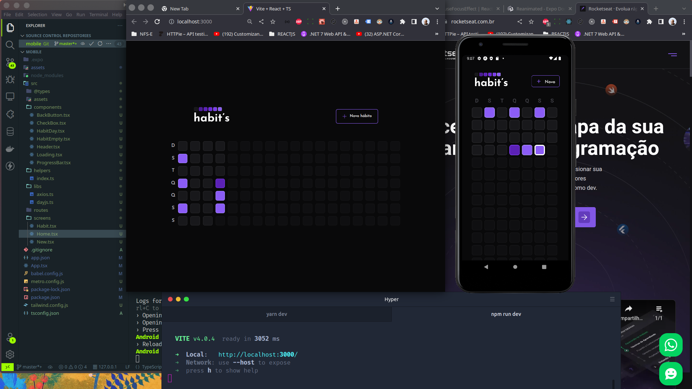

# App Habit's

  <p>
    
    <a href="https://opensource.org/licenses/MIT">
      
    </a>
  </p>

  <p align="center">
    
  </p>

# Como iniciar ?

- Clone app e abra a pasta com terminal

```bash
  git clone https://github.com/augustojaml/Redux-Games.git
```

- Iniciando o Server a pasta server

```bash
  cd server
  npm install
  npm run dev
```

- Iniciando o Web

```bash
  cd web
  npm install
  npm run dev
```

- Iniciando o Mobile

```bash
  cd mobile
  npm install
  npx expo start
```

## Sobre o Habit's

Apps desenvolvido através do primeiro NLW do ano 2023, o NLW SETUP e feito Juntamente com a [Rocketseat](https://www.rocketseat.com.br/)

O Habit's é um App que criado com a finalidade de gerenciar nossos hábitos.
<br>

## Tecnologias

Tecnologias e ferramentas utilizadas no desenvolvimento do projeto:

- [Fastify](https://www.fastify.io/docs/latest/)
- [Prisma](https://www.prisma.io/docs)
- [React](https://pt-br.reactjs.org/)
- [Radix UI](https://www.radix-ui.com/)
- [Expo](https://docs.expo.dev/)
- [React Native](https://reactnative.dev/)
- [React Native Reanimated](https://docs.swmansion.com/react-native-reanimated/)

- [Vite](https://vitejs.dev/)
- [TypeScript](https://www.typescriptlang.org/)
- [axios](https://github.com/axios/axios)
- [tailwindcss](https://tailwindcss.com/)
- [Nativewind](https://www.nativewind.dev/)
- [dayjs](https://day.js.org/)
- [zod](https://github.com/colinhacks/zod)
- [phosphoricons](https://phosphoricons.com/)
- E mais...

## Licença

<a href="https://opensource.org/licenses/MIT">
    
</a>

<br>

Esse projeto está sob a licença MIT. Veja o arquivo [LICENSE](/LICENSE) para mais detalhes.

---

# Augusto Monteiro

Feito com carinho :purple_heart: by [Augusto Monteiro](https://github.com/augustojaml)

[](https://www.linkedin.com/in/augustojaml)
[](mailto:jamonteirolima@gmail.com)
